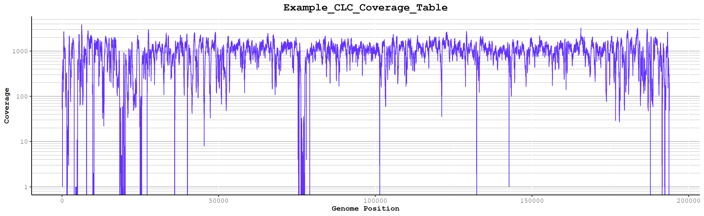
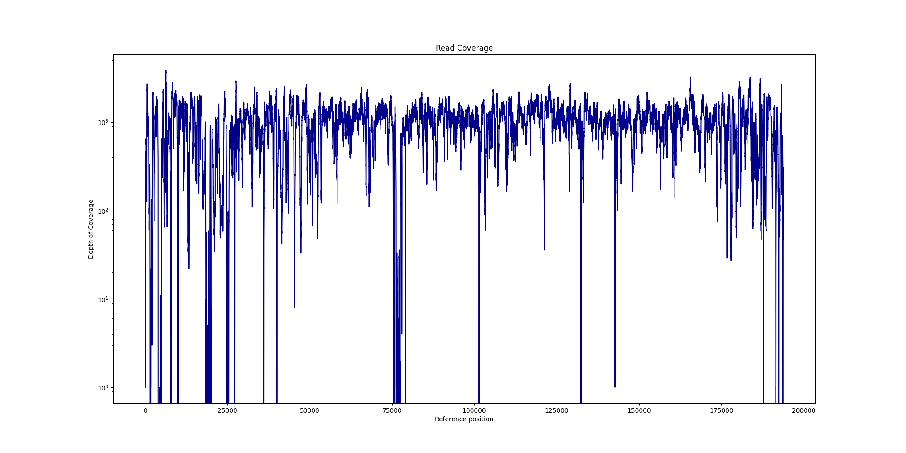

# Create Coverage Graphs from CLC Read-Alignment Stats

This repository contains Create_Coverage_Graphs_From_CLC_CSV, two batch scripts written for either R or Python for generating coverage graphs from a csv files exported from CLC Genomics workbench.

## Background

CLC Genomics Workbench is capable of producing a coverage graph that displays genomic position on the x-axis and the number of reads on the y-axis; however, the fidelity of the graph and customization options are somewhat restricted. Accordingly, this script was created to create a graph from the raw statistics produced by CLC. The input csv file is generated in CLC Genomics workbench, using the "QC for Targeted Sequencing" module and includes the following headers: "Mapping, Reference position, Name, Region, Target region position, Reference base, Coverage." Either script will generate a graph and save it as a .png file for each csv file found in the directory specified by the user.

## Requirements

### R

ggplot2

### Python

pandas

matplotlib

## How to Run

### R

Change Line 6 in the script and run in R studio.

### Python

```powershell
python Create_Coverage_Graphs_From_CLC_CSV.py --directory C:/PATH/TO/CLC/FILES/ --color darkblue
```

## Example Graphs

### R



### Python


